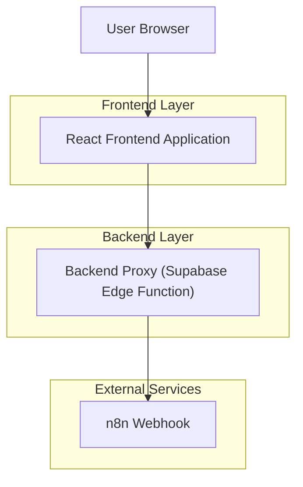
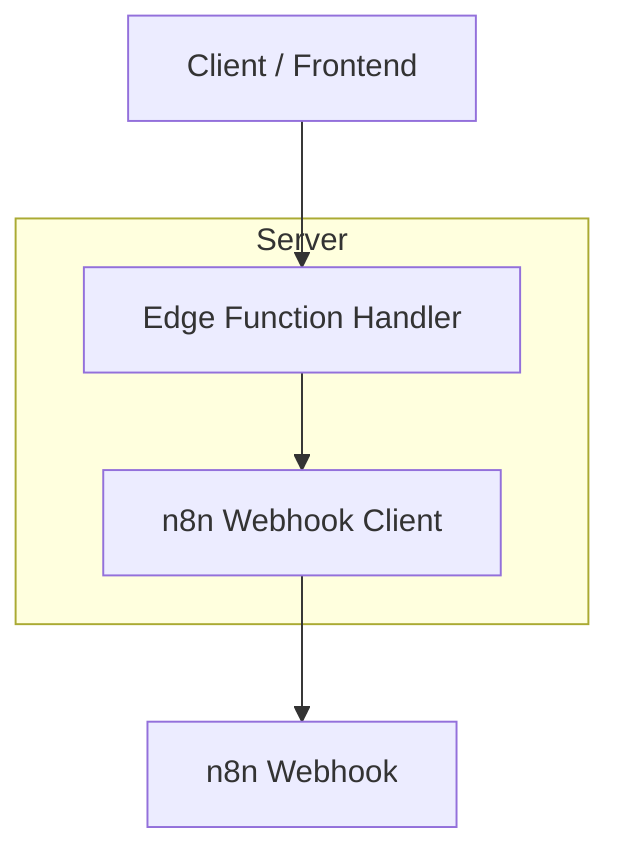

## 1.Architecture design


## 2.Technology Description
- Frontend: React@18 + vite + tailwindcss@3
- Backend: Supabase Edge Functions (proxy seguro para o webhook do n8n)

## 3.Route definitions
| Route | Purpose |
|-------|---------|
| / | Página inicial do app, com navegação para “Conexão” |
| /conexao | Página “Conexão”: formulário + geração/exibição de QRCode |

## 4.API definitions (If it includes backend services)
### 4.1 Core API
Gerar QRCode de conexão (proxy para n8n)
```
POST /functions/v1/whatsapp-connection
```

Request:
| Param Name| Param Type  | isRequired  | Description |
|-----------|-------------|-------------|-------------|
| connectionName | string | true | Nome amigável da conexão |
| whatsappNumberE164 | string | true | Número com DDI no padrão E.164 (ex.: +5511999999999) |

Response:
| Param Name| Param Type  | Description |
|-----------|-------------|-------------|
| qrCodeBase64 | string | QRCode em base64 (sem o prefixo data URL ou com, conforme padronização) |
| mimeType | string | MIME do QRCode (ex.: image/png) |

TypeScript (compartilhável):
```ts
export type CreateConnectionRequest = {
  connectionName: string;
  whatsappNumberE164: string;
};

export type CreateConnectionResponse = {
  qrCodeBase64: string;
  mimeType: string;
};
```

Example
```json
{
  "connectionName": "Atendimento Matriz",
  "whatsappNumberE164": "+5511999999999"
}
```

## 5.Server architecture diagram (If it includes backend services)


## 6.Data model(if applicable)
Não aplicável (não há